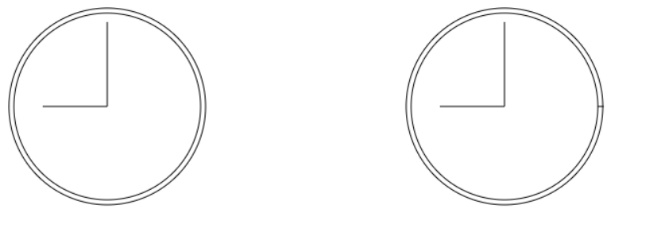
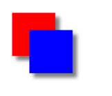
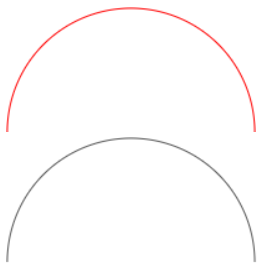
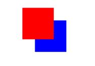

# Canvas-2D基础

## 1. 基本绘图

### 获取画布

在html中可以创建< canvas>元素来创建一个画布【至少要设置width和height属性】

想要在绘制图形，首先要获取对应的绘图上下文(绘图执行环境)，可用==getContext()==来获取，对于平面图形，传入参数为=='2d'==

```js
<canvas class='box' width='800' height='800'></canvas>

let box=document.querySelector('.box')
if(box.getContext){ //考虑到部分浏览器不支持画布
    let boxCanvas=box.getContext('2d')
}
```

### 填充与描边

fillStyle:以指定的样式来填充形状（**可以是颜色、渐变或图像**）

strokeStyle:为图像的边界着色

### 绘制矩形

矩形是唯一一个可以直接在2d画布中直接绘画出来的图形，绘制矩形的方法有三个,且参数都为==矩形x坐标、矩形y坐标、矩形宽度、矩形高度==：

**fillRect()**：以指定颜色（**需要先使用fillStyle指定颜色**）在画布在绘制并填充颜色

**strokeRect()**:以指定颜色（**需要先使用strokeStyle指定颜色**）在画布在绘制矩形的轮廓并填充颜色

**clearRect()**:擦除某个区域的绘制

```js
<canvas class='box' width='800' height='800'></canvas>

let box=document.querySelector('.box')
if(box.getContext){ //考虑到部分浏览器不支持画布
    let boxCanvas=box.getContext('2d')
    boxCanvas.fillStyle='red'
    boxCanvas.fillRect(10,10,50,50)
    boxCanvas.strokeStyle='blue'
    boxCanvas.strokeRect(10,10,50,50)
    boxCanvas.clear(15,15,30,30)
}
```

### 擦除clearRect()【重要】

在绘制矩形中的擦除方法可以擦除掉某个区域的绘制，可以使用这种方法擦除掉整个画布的绘制，可以同时结合==getImageData()以及putImageData()来绘制一些动态的效果==.

```js
<canvas class='box' width='800' height='800'></canvas>

let box=document.querySelector('.box')
if(box.getContext){ //考虑到部分浏览器不支持画布
    let boxCanvas=box.getContext('2d')
    boxCanvas.fillStyle='red'
    boxCanvas.fillRect(10,10,50,50)
    boxCanvas.clear(0,0,box.width,box.height)
}
```


### 绘制路径

- 通过路径可以创建复杂的形状和线条。要绘制路径，必须首先调用beginPath()方法以表示要开始绘制新路径。再调用下列方法来绘制路径。
  **arc(x, y, radius, startAng1e, endAngle, counterclockwise)**:
  -  以坐标(x，y)为圆心，
  - 以radius为半径绘制一条弧线，
  - 起始角度为startAngle,结束角度为endAngle (都是弧度)。
  - 最后一个参数counterclockwise表示是否逆时针计算起始角度和结束角度(默认为顺时针)。
- **arcTo(x1, y1, x2，y2, radius)**: 以给定半径radius, 经由(x1，y1)绘制一条从上-一点到(x2，y2)的弧线。
- **bezierCurveTo(c1x, cly, c2x， c2y, x， y)**: 以(c1x, c1y)为起始点坐标，(c2x，c2y)为控制点，绘制一条从上一点到(x，y) 的弧线(三次贝塞尔曲线)。
- **lineTo(x, y)**:绘制一条从上一点到(x，y)的直线。
- <span style='color:red'>**moveTo(x, y)**:不绘制线条，只把绘制光标移动到(x, y)</span>。
- **quadraticCurveTo(cx cy, x，y)**:以(ex, cy)为控制点， 绘制一条从上一点到(x，y)的弧线(二次贝塞尔曲线)。
- **rect(x, y,width. height)**:以给定宽度和高度在坐标点(x，y)绘制一个矩形。与strokeRect()和fillRect()的区别在于，它创建的是一条路径，而不是独立的图形。

创建路径之后，可以使用**closePath()**方法绘制一条返回起点的线。如果路径已经完成:

- 则既==可以指定fillStyle 属性并调用fill()方法来填充路径==.
- 也==可以指定strokeStyle 属性并调用stroke ()方法来描画路径==.
- 还==可以调用clip()方法基于已有路径创建一个新剪切区域==。
- 可以使用==isPointInpath(x,y)==判断坐标是否位于路径上

```js
    let box = document.querySelector('.canvasBox')
    if (box.getContext) {
        let boxCanvas = box.getContext('2d')
        boxCanvas.beginPath()
        boxCanvas.arc(100,100,99,0,2*Math.PI,false)
        boxCanvas.moveTo(194,100)
        boxCanvas.arc(100,100,94,0,2*Math.PI,false)
        boxCanvas.moveTo(100,100)
        boxCanvas.lineTo(100,15)
        boxCanvas.moveTo(100,100)
        boxCanvas.lineTo(35,100)  //移动画笔的效果

        boxCanvas.moveTo(600,100)
        boxCanvas.arc(500,100,99,0,2*Math.PI,false)
        // boxCanvas.moveTo(594,100)
        boxCanvas.arc(500,100,94,0,2*Math.PI,false)
        boxCanvas.moveTo(500,100)
        boxCanvas.lineTo(500,15)
        boxCanvas.moveTo(500,100)
        boxCanvas.lineTo(435,100) //不移动画笔的效果

        boxCanvas.stroke()
    }
```



### 绘制文本

文本和图像混合也是常见的绘制需求，因此 2D 绘图上下文还提供了绘制文本的方法，即

==fillText()、 strokeText()==:这两个方法都接收 4 个参数：（ 要绘制的字符串、x 坐标、y 坐标和可选的最大像素
宽度 ）。

而且，这两个方法最终绘制的结果都取决于以下 3 个属性。

- font：以 CSS 语法指定的字体样式、大小、字体族等，比如"10px Arial"。
- textAlign：指定文本的对齐方式，可能的值包括"start"、"end"、"left"、"right"和"center"。推荐使用"start"和"end"，不使用"left"和"right"，因为前者无论在从左到右
-  textBaseLine ： 指 定 文 本 的 基 线 ， 可 能 的 值 包 括 "top" 、 "hanging" 、 "middle" 、"alphabetic"、"ideographic"和"bottom"。

这些属性都有相应的默认值。

==fillText()方法使用fillStyle 属性绘制文本，而 strokeText()方法使用 strokeStyle 属性==。通常，fillText()方法
是使用最多的，因为它模拟了在网页中渲染文本。

```js
context.font = "bold 14px Arial";
context.textAlign = "center";
context.textBaseline = "middle";
context.fillText("12", 100, 20);
```

#### measureText()

这个方法接收一个参数，即要绘制的文本，然后返回一个TextMetrics 对象。这个返回的对象目前只有一个属性 width

measureText()方法使用 font、textAlign 和 textBaseline 属性当前的值计算绘制指定文本
后的大小【**也就是在绘制好文本以后的大小**】

```js
let fontSize = 100;
context.font = fontSize + "px Arial";
while(context.measureText("Hello world!").width > 140) {
fontSize--;
context.font = fontSize + "px Arial";
}
context.fillText("Hello world!", 10, 10);
context.fillText("Font size is " + fontSize + "px", 10, 50);
```

###  变换

2D 绘图上下文支持所有常见的绘制变换。在创建绘制 上下文时，会以默认值初始化变换矩阵，从而让绘制操作如实应用到绘制结果上。对绘制上下文应用变 换，可以导致以不同的变换矩阵应用绘制操作，从而产生不同的结果。 以下方法可用于改变绘制上下文的变换矩阵。

- rotate(angle)：围绕原点把图像旋转 angle 弧度。 

- scale(scaleX, scaleY)：通过在 x 轴乘以 scaleX、在 y 轴乘以 scaleY 来缩放图像。scaleX 和 scaleY 的默认值都是 1.0。

-  translate(x, y)：把原点移动到(x, y)。执行这个操作后，坐标(0, 0)就会变成(x, y)。

-  transform(m1_1, m1_2, m2_1, m2_2, dx, dy)：像下面这样通过矩阵乘法直接修改矩阵。

  - ```js
    m1_1 m1_2 dx 
    m2_1 m2_2 dy 
    0     0    1 
    ```

    

- setTransform(m1_1, m1_2, m2_1, m2_2, dx, dy)：把矩阵重置为默认值，再以传入的 参数调用 transform()。

#### save()与restore()

在变换时，包括 fillStyle 和 strokeStyle 属性，会一直保留在上下文中，直到再次修改 它们。虽然没有办法明确地将所有值都重置为默认值，但有两个方法可以帮我们跟踪变化：

- **save()方法**：调用这个方法后，所有这一时刻的设置 会被放到一个暂存栈中。保存之后，可以继续修改上下文
- **restore()方法**：在需要恢复之前的上下文时，可以调用这个方法会从暂存栈中取出并恢复之前保存的设置。

==多次调用 save()方法可以在暂 存栈中存储多套设置，然后通过 restore()可以系统地恢复==。

**注意**：<span style='color:red'>save()方法只保存应用到绘图上下文的设置和变换，不保存绘图上下文的内容</span>.

### 绘制图像-drawImage()

可以将现有的图像绘制到画布上【==可以是图片，也可以是另一个画布==】，<span style='color:red'>有**三种传参方式**，不同的传参有不同的效果</span>:

- **drawImage(x,y)**：传入一个 HTML 的**< img>**元素， 以及表示绘制目标的 x 和 y 坐标，结果是把图像绘制到指定位置。比如：

  - ```js
    let image = document.images[0];  
    context.drawImage(image, 10, 10); 
    ```

- **drawImage(x,y,目标宽度,目标高度)**：这里的缩放只影响绘制的图像，不影响上下文的变换矩阵

  - ```js
    context.drawImage(image, 50, 10, 20, 30);
    //执行之后，图像会缩放到 20 像素宽、30 像素高
    ```

- **drawImage(x,y,源图像 x 坐标、源图像 y 坐标、源图像宽度、源图像高度、目标区域 x 坐标、目标区域 y 坐标、 目标区域宽度和目标区域高度)**：只把图像绘制到上下文中的一个区域【==**相当于是裁剪**==】

  - ```html
    <body>
        
        <canvas class="box" width="800" height="800"></canvas>
    </body>
    <script>
        let img=document.querySelector('.img')
        let box=document.querySelector('.box')
        if(box.getContext('2d')){
            let context=box.getContext('2d')
            img.onload = function() {    //图片加载完毕后再执行绘制操作
                context.drawImage(img, 0, 10, 50, 50, 0, 100, 100, 60);
            };
           
        }
    </script>
    ```


### 图案-createPattern

图案是用于填充和描画图形的重复图像。要创建新图案，可以调用 createPattern()方法:

==createPattern（**< img>元素,平铺方式**）==：第二个参数的值与 CSS 的 background-repeat 属性是一样的，包括"repeat"、"repeat-x"、"repeat-y"和"no-repeat"。

```js
    let img = document.querySelector('.img')
    let box = document.querySelector('.box')
    if (box.getContext('2d')) {
        let context = box.getContext('2d')
        img.onload = () => {
            let pattern = context.createPattern(img, 'repeat')
            context.fillStyle = pattern;
            context.fillRect(193, 133,193, 133)  //这里因为图片的宽高是（193, 133），这样可以刚好绘制一张图片
        }
    }
```

<span style='color:red'>注意</span>：与渐变相同，图案绘制的起点是画布的原点（0，0），所以<span style='color:red'>**图案开始绘制的位置并不是绘制区域的位置**</span>。

### 阴影

2D 上下文可以根据以下属性的值自动为已有形状或路径生成阴影。

-  shadowColor：CSS 颜色值，表示要绘制的阴影颜色，默认为黑色。 
- shadowOffsetX：阴影相对于形状或路径的 x 坐标的偏移量，默认为 0。
-  shadowOffsetY：阴影相对于形状或路径的 y 坐标的偏移量，默认为 0。
-  shadowBlur：像素，表示阴影的模糊量。默认值为 0，表示不模糊。

 这些属性都可以通过 context 对象读写。只要在绘制图形或路径前给这些属性设置好适当的值， **阴影就会自动生成**：

```js
context.shadowOffsetX = 5; 
context.shadowOffsetY = 5; 
context.shadowBlur = 4; 
context.shadowColor = "rgba(0, 0, 0, 0.5)"; 
// 绘制红色矩形
context.fillStyle = "#ff0000"; 
context.fillRect(10, 10, 50, 50); 
// 绘制蓝色矩形
context.fillStyle = "rgba(0,0,255,1)";
```



### 线性渐变

#### createLinearGradient实例

线性渐变通过 createLinearGradient 的实例表示，在 2D 上下文中创建和修改。

**创建一个新的 线性渐变**：调用上下文的==createLinearGradient（**起点 x 坐标， 起点 y 坐标，终点 x 坐标，终点 y 坐标**）==方法。调用之后，该方法会以指定大小创建一个新的 CanvasGradient 对象并返回实例

#### 指定色标-addColorStop()

有了渐变对象后，接下来要使用 ==addColorStop（**色标位置， CSS 颜色字符串**）==方法为渐变指定色标。

<span style='color:red'>色标位置通过 0～1 范围内的值表示，0 是第一种颜色，1 是最后 一种颜色</span>.

```js
let gradient = context.createLinearGradient(30, 30, 70, 70); 
gradient.addColorStop(0, "white"); 
gradient.addColorStop(1, "black");
ontext.fillStyle = gradient; 
context.fillRect(30, 30, 50, 50); 
```

#### 同步渐变范围

```js
    let box = document.querySelector('.box')
    if (box.getContext('2d')) {
        let context = box.getContext('2d')
        let gradient = fn(context, 10, 10, 80, 80);
        gradient.addColorStop(0, "white");
        gradient.addColorStop(1, "black");
        context.fillStyle = gradient;
        context.fillRect(10, 10, 200, 200);
    }
    function fn(context, x, y, width, height) { //让渐变的范围可以覆盖到整个矩形
        return context.createLinearGradient(x, y, x + width, y + height)
    }
```

### 径向渐变

创建一个createRadialGradient实例：调用上下文的==createRadialGradient（起点圆形中心 x坐标、起点圆形中心y 坐标，起点圆形中心半径，终点圆形中心 x坐标、终点圆形中心y 坐标，终点圆形中心半径）==。

要创建起点圆心在形状中心并向外扩散的径向渐变，需要将两个圆形设置为同心圆：

```js
let gradient = context.createRadialGradient(55, 55, 10, 55, 55, 30); 
gradient.addColorStop(0, "white"); 
gradient.addColorStop(1, "black"); 
// 绘制渐变矩形
context.fillStyle = gradient; 
context.fillRect(30, 30, 50, 50); 
```


### 图像数据

#### getImageData()

可以使用 getImageData()方法获取原始图像数据【==注意：只是图像的数据，而不是图像，但可以通过**putImageData**写回到画布上以显示==】

这个方法 接收 4 个参数：要取得数据中第一个像素的左上角坐标和要取得的像素宽度及高度。

例如，要从(10, 5) 开始取得 50 像素宽、50 像素高的区域对应的数据：

```js
 let imageData = context.getImageData(10, 5, 50, 50); 
```

返回的对象是一个 ImageData 的实例:  ImageData 对象都包含 3 个属性：width、height 和 data，其中，data 属性是包含图像的原始像素信息的数组。

每个像素在 data 数组中都由 4 个值表 示，分别代表红、绿、蓝和透明度值。

换句话说，第一个像素的信息包含在第 0 到第 3 个值中

```js
let data = imageData.data,  red = data[0],  green = data[1],  blue = data[2],  alpha = data[3]; 
```

 这个数组中的每个值都在 0~255 范围内（包括 0 和 255）。对原始图像数据进行访问可以更灵活地操 作图像。

**灰度化半圆**：

```html
<body>
    <canvas class="img" width="200" height="100"></canvas>
    <canvas class="box" width="800" height="800"></canvas>
</body>
<script>
    let imageBox = document.querySelector('.img')
    let box = document.querySelector('.box')
    if (box.getContext('2d') && imageBox.getContext('2d')) {
        let context = box.getContext('2d')
        let image = imageBox.getContext('2d')
        image.beginPath()
        image.arc(100, 100, 99, 0, 2 * Math.PI, false)
        image.fillStyle = 'red'
        image.strokeStyle='red'
        image.stroke()

        let imageData, data,
            i, len, average,
            red, green, blue, alpha;
        // 绘制图像
        let imagecan = image.getImageData(0, 0, imageBox.width, imageBox.height);
        context.putImageData(imagecan, 0, 0);
        // 取得图像数据
        imageData = context.getImageData(0, 0, imagecan.width, imagecan.height);
        data = imageData.data;
        for (i = 0, len = data.length; i < len; i += 4) {
            red = data[i];
            green = data[i + 1];
            blue = data[i + 2];
            alpha = data[i + 3];
            // 取得 RGB 平均值
            average = Math.floor((red + green + blue) / 3);
            // 设置颜色，不管透明度
            data[i] = average;
            data[i + 1] = average;
            data[i + 2] = average;
        }
        // 将修改后的数据写回 ImageData 并应用到画布上显示出来
        imageData.data = data;
        context.putImageData(imageData, 0, 0);
    }
</script>
```



### 合成

#### globalAlpha 

globalAlpha 属性是一个范围在 0~1 的值（包括 0 和 1），用于指定所有绘制内容的透明度，默认值为 0。如果所有后来的绘制都需要使用同样的透明度，那么可以将 globalAlpha 设置为适当的值， 执行绘制，然后再把 globalAlpha 设置为 0。比如：

```js
/ 绘制红色矩形
context.fillStyle = "#ff0000"; 
context.fillRect(10, 10, 50, 50); 
// 修改全局透明度
context.globalAlpha = 0.5; 
// 绘制蓝色矩形
context.fillStyle = "rgba(0,0,255,1)"; 
context.fillRect(30, 30, 50, 50); 
// 重置
context.globalAlpha = 0; 
```

因为在绘制蓝色矩形前 globalAlpha 被设置 成了 0.5，所以蓝色矩形就变成半透明了，从而可以透过它看到下面的红色矩形

#### globalComposition Operation

globalCompositionOperation 属性表示新绘制的形状如何与上下文中已有的形状融合。这个属 性是一个字符串，可以取下列值:

- **source-over**：默认值，新图形绘制在原有图形上面。 
- **source-in**：新图形只绘制出与原有图形重叠的部分，画布上其余部分全部透明。 
- **source-out**：新图形只绘制出不与原有图形重叠的部分，画布上其余部分全部透明。
- **source-atop**：新图形只绘制出与原有图形重叠的部分，原有图形不受影响。
- **destination-over**：新图形绘制在原有图形下面，重叠部分只有原图形透明像素下的部分可见。
- **destination-in**：新图形绘制在原有图形下面，画布上只剩下二者重叠的部分，其余部分完全 透明。
- **destination-out**：新图形与原有图形重叠的部分完全透明，原图形其余部分不受影响。 
- **destination-atop**：新图形绘制在原有图形下面，原有图形与新图形不重叠的部分完全透明。 
- **lighter**：新图形与原有图形重叠部分的像素值相加，使该部分变亮。
- **copy**：新图形将擦除并完全取代原有图形。 
- **xor**：新图形与原有图形重叠部分的像素执行“异或”计算

```js
// 绘制红色矩形
context.fillStyle = "#ff0000"; 
context.fillRect(10, 10, 50, 50); 
// 设置合成方式
context.globalCompositeOperation = "destination-over"; 
// 绘制蓝色矩形
context.fillStyle = "rgba(0,0,255,1)"; 
context.fillRect(30, 30, 50, 50); 
```



这里由于使用了 **destination-over** ，使得后绘制的应该在红色矩形之上的蓝色矩形被红色矩形所覆盖
